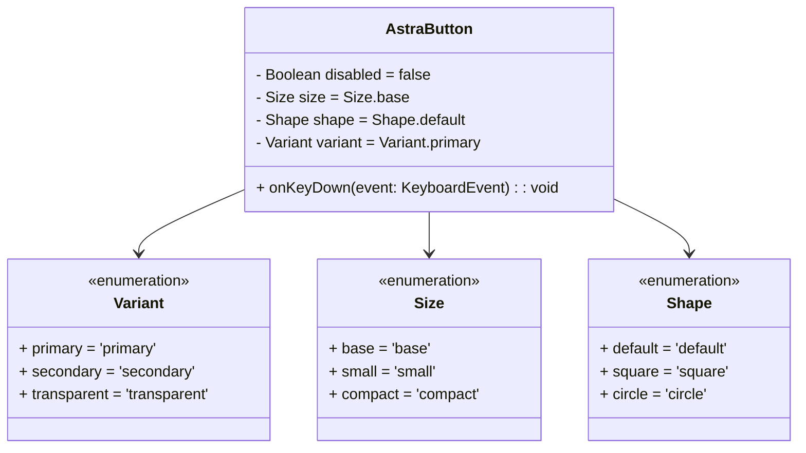
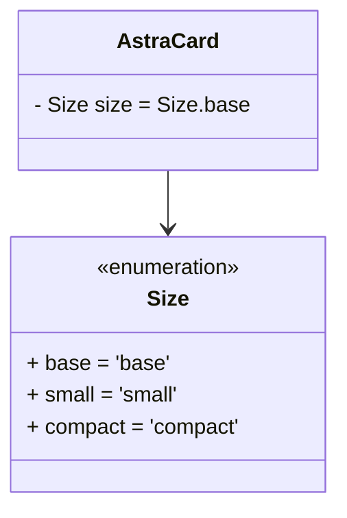
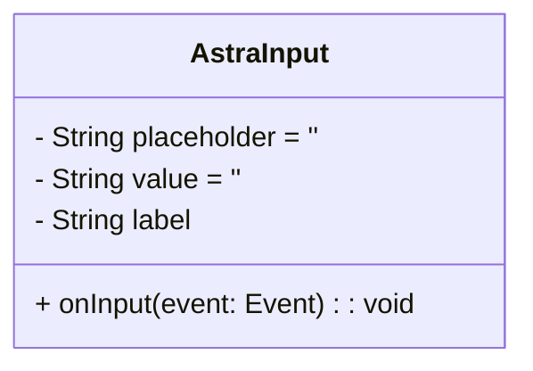
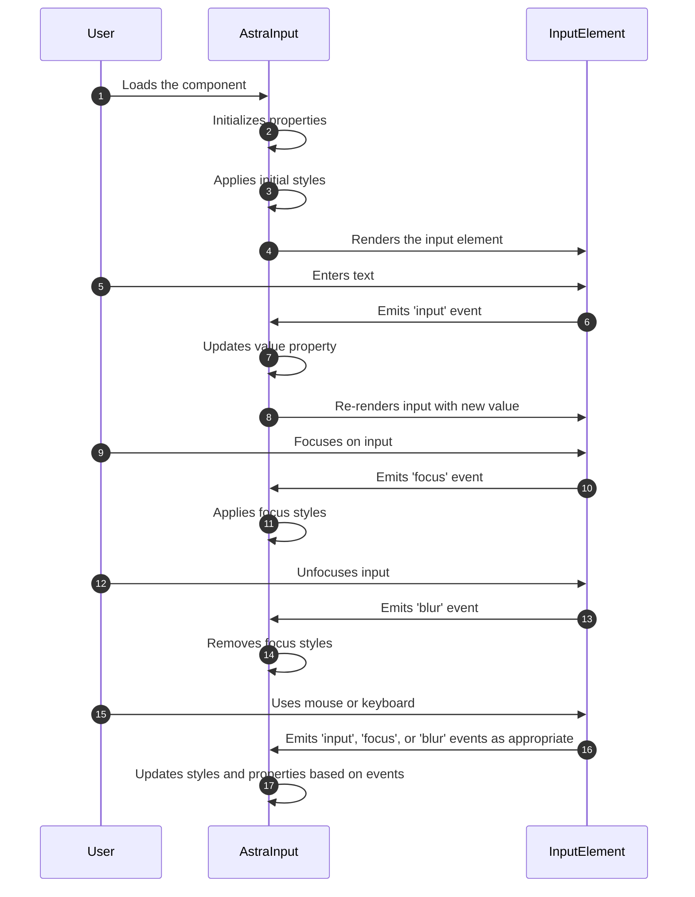
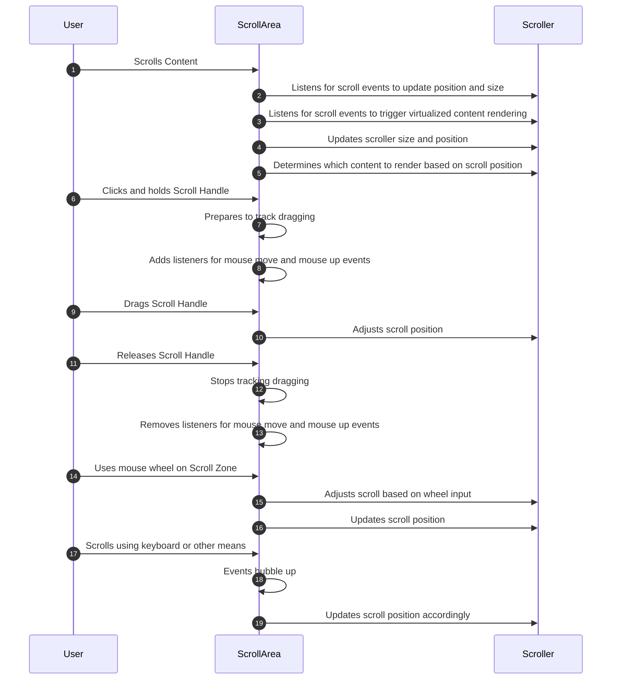
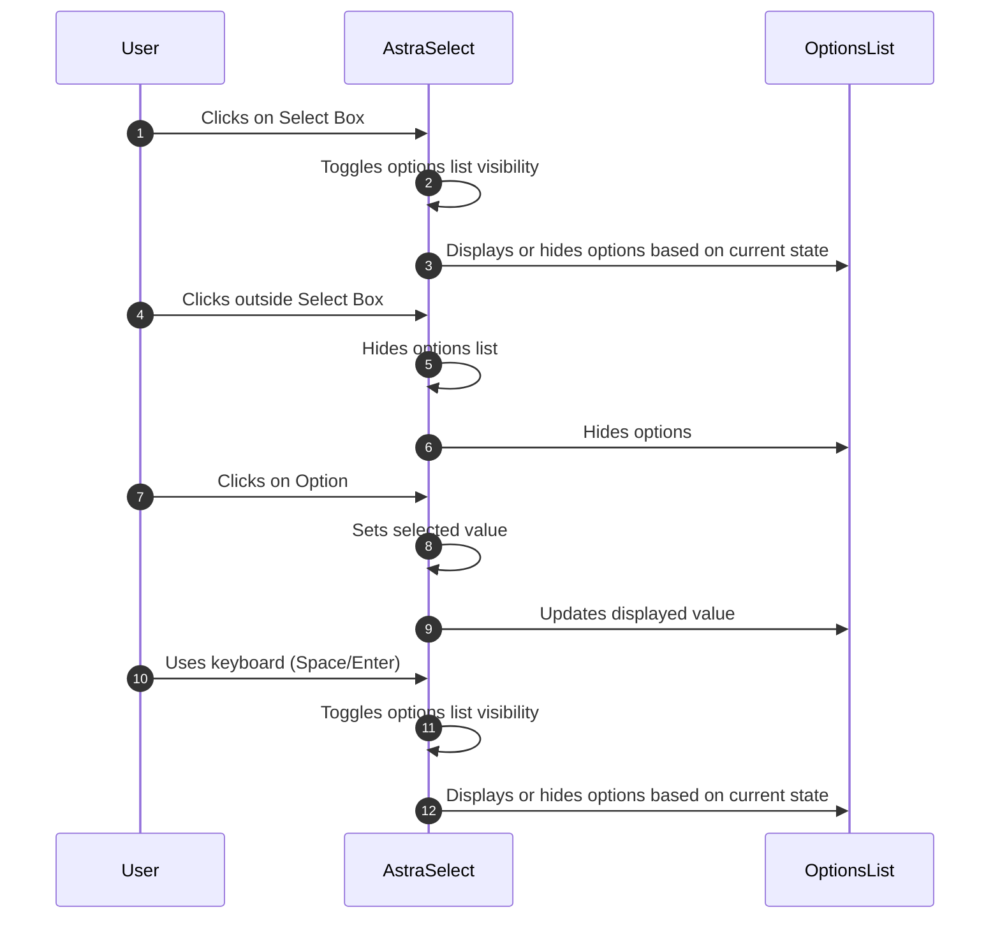
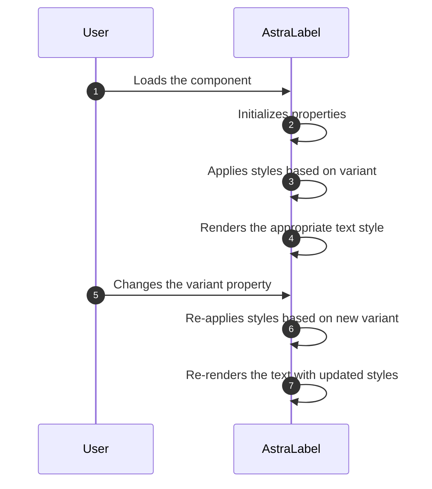

# Architecture Overview

### &lt;astra-button /&gt;

### &lt;astra-card /&gt;

### &lt;astra-input /&gt;

### &lt;astra-scroll-area /&gt;

### &lt;astra-select /&gt;

### &lt;astra-text /&gt;

### &lt;astra-calendar /&gt;

[Click to see notes](calendar/README.md)

### &lt;astra-charts /&gt;

[Click to see notes](charts/README.md)

### &lt;universe-editor /&gt;

[Click to see notes](universe/README.md)
