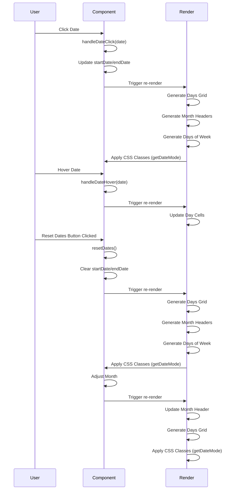

# Calendar

## Explanation

1. **User Clicks Date**:

   - **handleDateClick(date)** is invoked.
   - **Update startDate/endDate** based on the clicked date.
   - **Trigger Re-render**: The component re-renders to reflect the updated dates.
   - **Render Updates**:
     - **Generate Days Grid**: Creates or updates the grid of days.
     - **Generate Month Headers**: Updates the header with the current month/year.
     - **Generate Days of Week**: Displays the abbreviated days of the week.
     - **Apply CSS Classes**: Uses `getDateMode` to apply the correct CSS classes to each day cell based on the selection.

2. **User Hovers Date**:

   - **handleDateHover(date)** is invoked.
   - **Update Day Cells**: Updates the display to reflect the hovered date, if necessary.
   - **Trigger Re-render**: The component re-renders to show the hover effect.

3. **User Clicks Reset Dates Button**:

   - **resetDates()** is invoked.
   - **Clear startDate/endDate**: Resets the selected date range.
   - **Trigger Re-render**: The component re-renders to reflect the cleared dates.
   - **Render Updates**:
     - **Generate Days Grid**: Refreshes the grid of days.
     - **Generate Month Headers**: Updates the header.
     - **Generate Days of Week**: Displays the days of the week.
     - **Apply CSS Classes**: Updates CSS classes using `getDateMode`.

4. **Adjust Month**:
   - **Adjust Month**: Changes the `viewingMonth`.
   - **Trigger Re-render**: Re-renders the component to show the updated month.
   - **Render Updates**:
     - **Update Month Header**: Reflects the new month/year in the header.
     - **Generate Days Grid**: Updates the days grid for the new month.
     - **Apply CSS Classes**: Applies the appropriate classes to day cells.

This diagram and explanation show how user interactions with the calendar trigger updates to properties, which in turn prompt re-rendering of the component with updated visuals.
