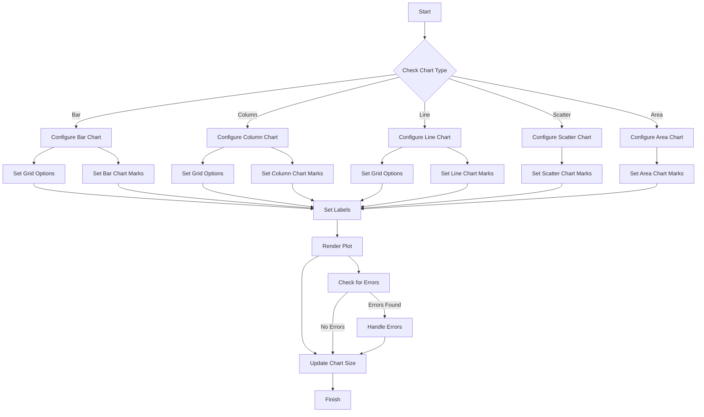

# Chart

```mermaid
flowchart TD
    A[Start] --> B{Check Chart Type}
    B -->|Bar| C[Configure Bar Chart]
    B -->|Column| D[Configure Column Chart]
    B -->|Line| E[Configure Line Chart]
    B -->|Scatter| F[Configure Scatter Chart]
    B -->|Area| G[Configure Area Chart]
    C --> H[Set Grid Options]
    C --> I[Set Bar Chart Marks]
    D --> J[Set Grid Options]
    D --> K[Set Column Chart Marks]
    E --> L[Set Grid Options]
    E --> M[Set Line Chart Marks]
    F --> N[Set Scatter Chart Marks]
    G --> O[Set Area Chart Marks]
    H --> P[Set Labels]
    I --> P
    J --> P
    K --> P
    L --> P
    M --> P
    N --> P
    O --> P
    P --> Q[Render Plot]
    Q --> R[Update Chart Size]
    R --> S[Finish]
    Q --> T[Check for Errors]
    T -->|Errors Found| U[Handle Errors]
    T -->|No Errors| R
    U --> R
```

# Composed Chart

Inherits from Chart and decorates it with additional UI.
