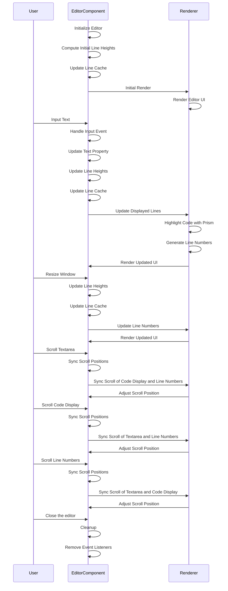
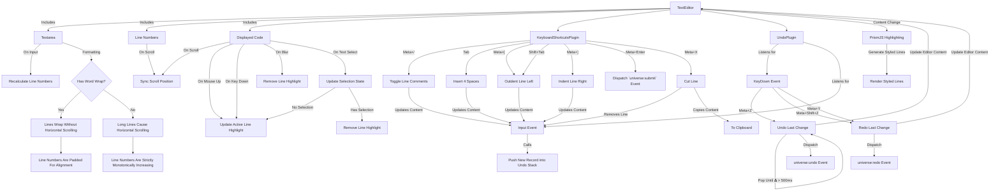

# Sequence Diagram (Universe)

# Architecture Diagram (Universe + Plugins)

## Explanation

The `Universe` component is a custom web component using the Lit library for building and rendering a text editor with syntax highlighting.

### Key Features and Behavior

1. **Initialization and Styling**

   - It includes specific styles to hide scrollbars and apply syntax highlighting (via PrismJS)

2. **Properties and State**

   - `wrap`: A Boolean property to enable or disable word wrapping in the editor.
   - `text`: A property containing the SQL code displayed in the editor.
   - `activeLineNumber`: Indicates which line has focus for displaying visual emphasis.
   - `hasSelectedText`: When true, disables active line highlighting.
   - `highlightedCode`, `cache`, `lines`: Internal states used to manage syntax highlighting, line heights, and ultimately what is visible to the user.

3. **Lifecycle Methods**

   - `connectedCallback()`: Sets up event listeners for dealing with resizing.
   - `disconnectedCallback()`: Cleans up event listeners when the component is removed from the DOM.
   - `firstUpdated()`: Updates the line cache after the initial render to ensure proper line number formatting.

4. **Rendering**

   - The `render()` method defines the structure of the editor, including the line numbers, code display area, and textarea.
   - The `<textarea />`, `
` and `
` are synchronized to scroll in-sync.
   - Omits active line when there is a text selection.

5. **Handling Input and Updates**

   - `onInput()`: Updates the `text` property and refreshes the line cache whenever the user types into the textarea.
   - `updateLineCache()`: Processes the input text, applies syntax highlighting with Prism.js, and updates the line heights.
   - `handleResize()`: Updates the line cache / ensures proper formatting

6. **Line Number Calculation**

   - `getLineNumbers()`: Computes and returns the line numbers, taking into account wrapped content and line heights.
   - `handleSelectionChange()`: Toggles `hasSelectedText`'s value
   - `handleScrollEnd()`: Syncs the `<textarea />` with `
` _after scrolling_ has completed; preserves smooth momentum scrolling

7. **Helper Methods**
   - `computeLineHeight()`: Determines the height of a single line of text by creating a temporary element.
   - `highlightedCode`: Uses Prism.js to apply syntax highlighting to the SQL code.
