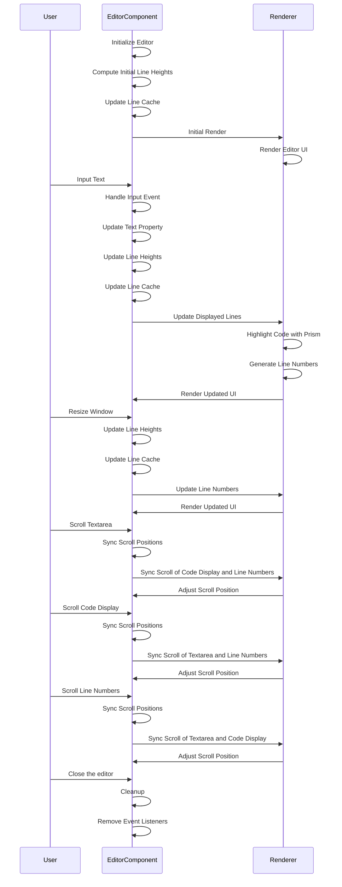

# Universe Sequence

## Explanation

The `Universe` component is a custom web component using the Lit library for building and rendering a text editor with syntax highlighting.

### Key Features and Behavior

1. **Initialization and Styling**

   - The component initializes with default styles and handles its layout and appearance using CSS.
   - It includes specific styles to hide scrollbars and apply syntax highlighting.

2. **Properties and State**

   - `wordWrap`: A Boolean property to enable or disable word wrapping in the editor.
   - `text`: A property containing the SQL code displayed in the editor.
   - `highlightedCode`, `cache`, `lines`: Internal states used to manage syntax highlighting, line heights, and rendered lines.

3. **Lifecycle Methods**

   - `connectedCallback()`: Sets up event listeners for resizing the window and updating line cache.
   - `disconnectedCallback()`: Cleans up event listeners when the component is removed from the DOM.
   - `firstUpdated()`: Updates the line cache after the initial render to ensure proper line number handling.

4. **Rendering**

   - The `render()` method defines the structure of the editor, including the line numbers, code display area, and textarea.
   - The `textarea` and code display are synchronized to scroll together.

5. **Handling Input and Updates**

   - `onInput()`: Updates the `text` property and refreshes the line cache whenever the user types into the textarea.
   - `updateLineCache()`: Processes the input text, applies syntax highlighting with Prism.js, and updates the line heights.

6. **Line Number Calculation**

   - `getLineNumbers()`: Computes and returns the line numbers, taking into account wrapped content and line heights.

7. **Helper Methods**
   - `computeLineHeight()`: Determines the height of a single line of text by creating a temporary element.
   - `highlightedCode`: Uses Prism.js to apply syntax highlighting to the SQL code.
